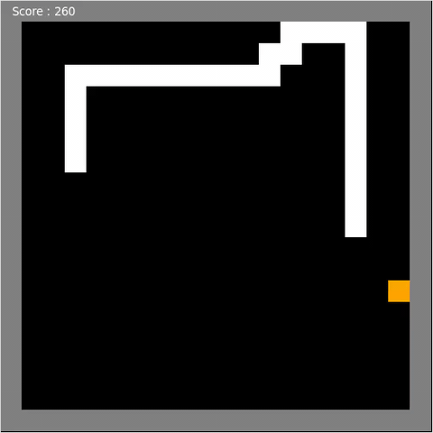
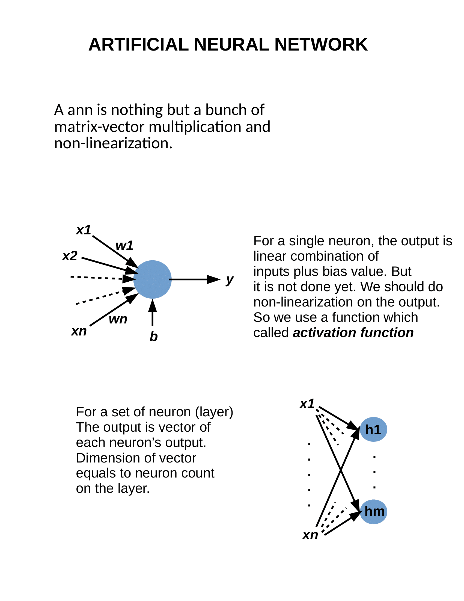
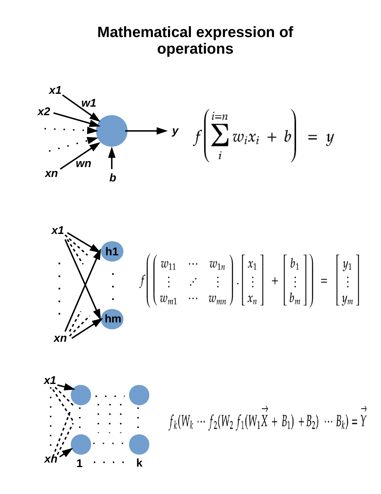
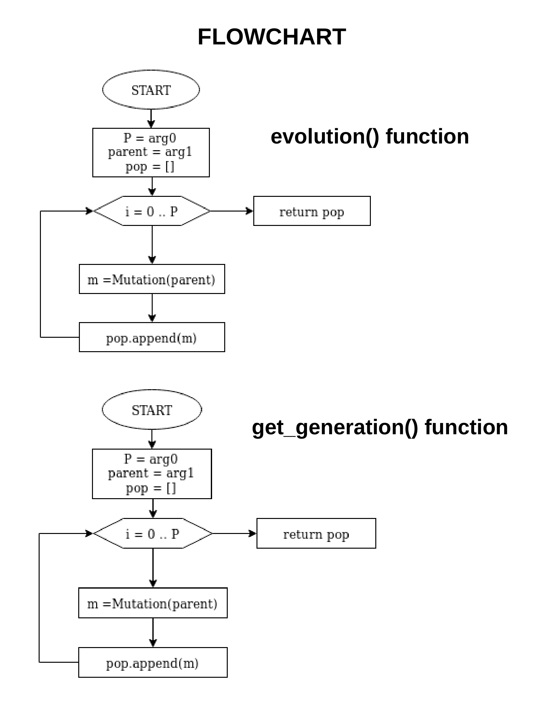
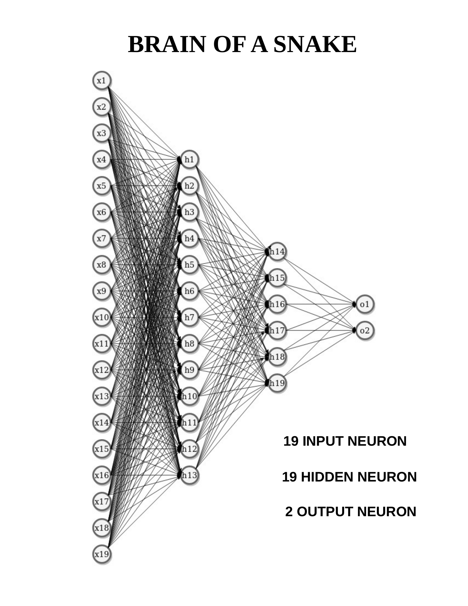

# snake_game_ai

Bringing solutions to the classic snake game from the nature perspective.  

Every snake has 19 input neurons, 19 hidden layer neurons, 2 output neurons.  

800 generation wasted for training the snake.
Every generation had 500 snakes. It makes 400000 snakes and 400000 different games. 

